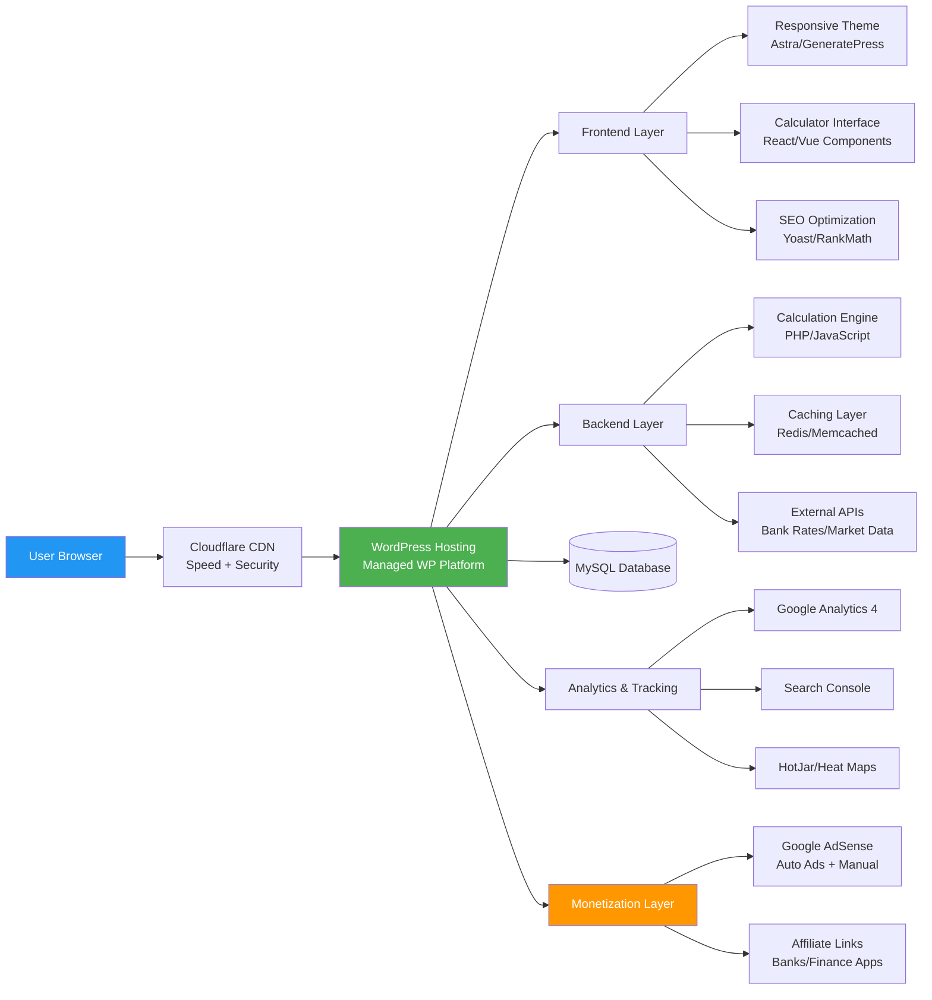
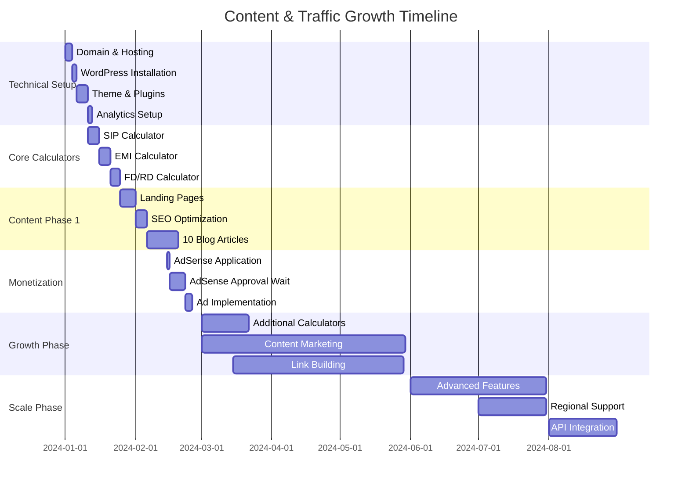
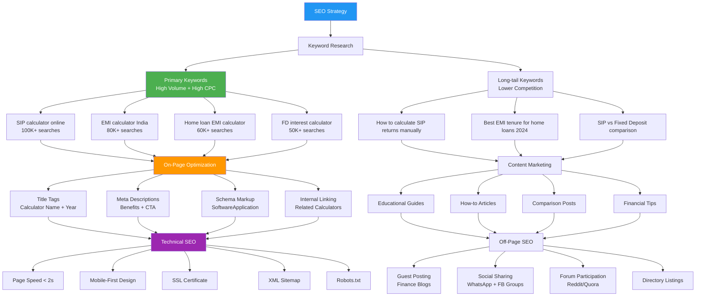
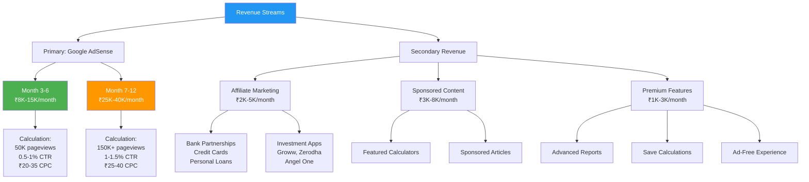
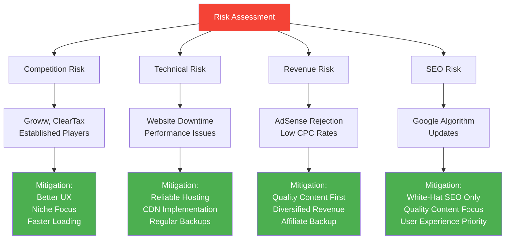
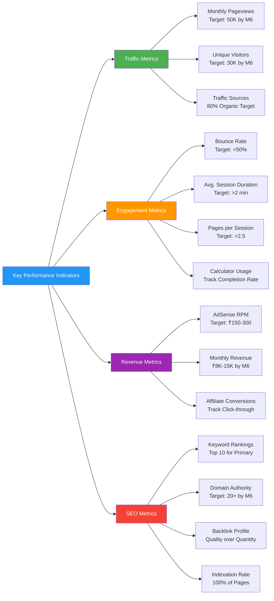

# Finance Calculator Hub - Project Structure

## Executive Summary
A comprehensive financial calculator platform targeting the Indian market with high-CPC potential through Google AdSense monetization.

## Project Architecture Diagram

```mermaid
graph TB
    Start[Finance Calculator Hub Project]
    
    Start --> Phase1[Phase 1: Foundation<br/>Weeks 1-4]
    Start --> Phase2[Phase 2: Content Expansion<br/>Weeks 5-8]
    Start --> Phase3[Phase 3: Growth & Optimization<br/>Months 3-6]
    Start --> Phase4[Phase 4: Scale & Revenue<br/>Months 7-12]
    
    Phase1 --> P1_1[Technical Setup]
    Phase1 --> P1_2[Core Calculators]
    Phase1 --> P1_3[Basic SEO Setup]
    
    P1_1 --> P1_1_1[Domain & Hosting<br/>financecalc.in]
    P1_1 --> P1_1_2[WordPress Installation<br/>+ SSL Certificate]
    P1_1 --> P1_1_3[Theme Selection<br/>Mobile-First Design]
    P1_1 --> P1_1_4[Calculator Plugins<br/>Installation]
    P1_1 --> P1_1_5[Analytics Setup<br/>GA4 + Search Console]
    
    P1_2 --> P1_2_1[SIP Calculator<br/>Target: 100K+ searches/month]
    P1_2 --> P1_2_2[EMI Calculator<br/>Home/Car/Personal Loans]
    P1_2 --> P1_2_3[FD/RD Calculator<br/>Multiple Banks]
    
    P1_3 --> P1_3_1[On-Page SEO<br/>Meta Tags + Schema]
    P1_3 --> P1_3_2[Site Speed Optimization<br/>Target: <2s load time]
    P1_3 --> P1_3_3[Mobile Responsiveness<br/>Test on all devices]
    
    Phase2 --> P2_1[Additional Calculators]
    Phase2 --> P2_2[Content Marketing]
    Phase2 --> P2_3[Monetization Setup]
    
    P2_1 --> P2_1_1[PPF Calculator]
    P2_1 --> P2_1_2[ELSS Calculator]
    P2_1 --> P2_1_3[Tax Calculator<br/>80C Deductions]
    P2_1 --> P2_1_4[Loan Comparison Tool]
    P2_1 --> P2_1_5[Investment Comparison Tool]
    
    P2_2 --> P2_2_1[Blog Section Setup]
    P2_2 --> P2_2_2[15-20 SEO Articles<br/>Target Keywords]
    P2_2 --> P2_2_3[Calculator Usage Guides]
    P2_2 --> P2_2_4[Financial Tips Content]
    
    P2_3 --> P2_3_1[Google AdSense Application<br/>15+ Quality Pages Required]
    P2_3 --> P2_3_2[Ad Placement Strategy<br/>High-Value Zones]
    P2_3 --> P2_3_3[Privacy Policy<br/>Terms & Conditions]
    
    Phase3 --> P3_1[Traffic Growth]
    Phase3 --> P3_2[User Experience]
    Phase3 --> P3_3[Revenue Optimization]
    
    P3_1 --> P3_1_1[Link Building Campaign]
    P3_1 --> P3_1_2[Social Media Presence]
    P3_1 --> P3_1_3[Content Frequency<br/>2-3 articles/week]
    P3_1 --> P3_1_4[Target: 50K pageviews/month]
    
    P3_2 --> P3_2_1[A/B Testing<br/>Calculator Layouts]
    P3_2 --> P3_2_2[User Feedback System]
    P3_2 --> P3_2_3[Print-Friendly Results]
    P3_2 --> P3_2_4[WhatsApp Sharing]
    
    P3_3 --> P3_3_1[AdSense Optimization<br/>CPC: ₹20-35]
    P3_3 --> P3_3_2[Bank Affiliate Programs]
    P3_3 --> P3_3_3[Target Revenue:<br/>₹8K-15K/month]
    
    Phase4 --> P4_1[Advanced Features]
    Phase4 --> P4_2[Scale Traffic]
    Phase4 --> P4_3[Diversified Revenue]
    
    P4_1 --> P4_1_1[API Integration<br/>Live Interest Rates]
    P4_1 --> P4_1_2[User Accounts<br/>Save Calculations]
    P4_1 --> P4_1_3[Advanced Tax Tools]
    P4_1 --> P4_1_4[Retirement Planning<br/>Calculator]
    
    P4_2 --> P4_2_1[150K+ pageviews/month]
    P4_2 --> P4_2_2[Email Marketing]
    P4_2 --> P4_2_3[YouTube Integration<br/>Calculator Tutorials]
    P4_2 --> P4_2_4[Regional Language Support]
    
    P4_3 --> P4_3_1[Sponsored Calculators]
    P4_3 --> P4_3_2[Premium Features]
    P4_3 --> P4_3_3[Financial Product Leads]
    P4_3 --> P4_3_4[Target Revenue:<br/>₹25K-40K/month]
    
    style Start fill:#2196F3,color:#fff
    style Phase1 fill:#4CAF50,color:#fff
    style Phase2 fill:#FF9800,color:#fff
    style Phase3 fill:#9C27B0,color:#fff
    style Phase4 fill:#F44336,color:#fff
```



## Technical Stack Architecture



## Calculator Priority Matrix

```mermaid
quadrantChart
    title Calculator Implementation Priority
    x-axis Low Search Volume --> High Search Volume
    y-axis Low CPC --> High CPC
    quadrant-1 High Priority (Launch First)
    quadrant-2 Medium Priority (Phase 2)
    quadrant-3 Low Priority (Phase 3+)
    quadrant-4 Quick Wins (Early Phase 2)
    
    SIP Calculator: [0.9, 0.8]
    EMI Calculator: [0.85, 0.9]
    Home Loan EMI: [0.8, 0.95]
    FD Calculator: [0.7, 0.6]
    RD Calculator: [0.5, 0.5]
    PPF Calculator: [0.65, 0.7]
    ELSS Calculator: [0.6, 0.75]
    Tax Calculator: [0.75, 0.85]
    Loan Comparison: [0.55, 0.8]
    Retirement Planner: [0.4, 0.65]
```

## Content Strategy Roadmap



## SEO Strategy Flow



## Revenue Projection Model



## Team Structure & Responsibilities

```mermaid
graph TB
    Team[Project Team]
    
    Team --> Tech[Technical Team]
    Team --> Content[Content Team]
    Team --> Marketing[Marketing Team]
    
    Tech --> Dev[Developer]
    Tech --> Designer[UI/UX Designer]
    
    Dev --> D1[WordPress Setup<br/>& Maintenance]
    Dev --> D2[Calculator<br/>Implementation]
    Dev --> D3[Performance<br/>Optimization]
    Dev --> D4[Technical SEO]
    
    Designer --> DS1[UI Design<br/>Calculator Interface]
    Designer --> DS2[Brand Identity<br/>Logo & Colors]
    Designer --> DS3[Mobile Design<br/>Responsive Layouts]
    
    Content --> Writer[Content Writer]
    Content --> Finance[Finance Expert]
    
    Writer --> W1[Blog Articles<br/>2-3 per week]
    Writer --> W2[Calculator<br/>Descriptions]
    Writer --> W3[SEO Optimization<br/>Meta Content]
    
    Finance --> F1[Formula Validation<br/>Accuracy Check]
    Finance --> F2[Financial Guides<br/>Expert Content]
    Finance --> F3[Market Research<br/>Interest Rates]
    
    Marketing --> SEO[SEO Specialist]
    Marketing --> Social[Social Media Manager]
    
    SEO --> S1[Keyword Research<br/>Monthly Analysis]
    SEO --> S2[Link Building<br/>Outreach Campaign]
    SEO --> S3[Analytics Monitoring<br/>Weekly Reports]
    
    Social --> SM1[Social Media<br/>Daily Posts]
    Social --> SM2[Community<br/>Engagement]
    Social --> SM3[Influencer<br/>Partnerships]
    
    style Team fill:#2196F3,color:#fff
    style Tech fill:#4CAF50,color:#fff
    style Content fill:#FF9800,color:#fff
    style Marketing fill:#9C27B0,color:#fff
```



## Risk Management & Mitigation



## Success Metrics & KPIs



---

## Next Steps

1. **Week 1**: Team formation & role assignment
2. **Week 1**: Domain registration & hosting setup
3. **Week 2**: WordPress installation & theme configuration
4. **Week 3-4**: Core calculator development (SIP, EMI, FD)
5. **Week 5**: Content creation kickoff
6. **Week 6**: AdSense application preparation
7. **Month 3**: Traffic analysis & optimization
8. **Month 6**: Revenue milestone review

## Contact & Collaboration

This document should be reviewed weekly during the first phase and bi-weekly afterward to track progress against the planned milestones.
